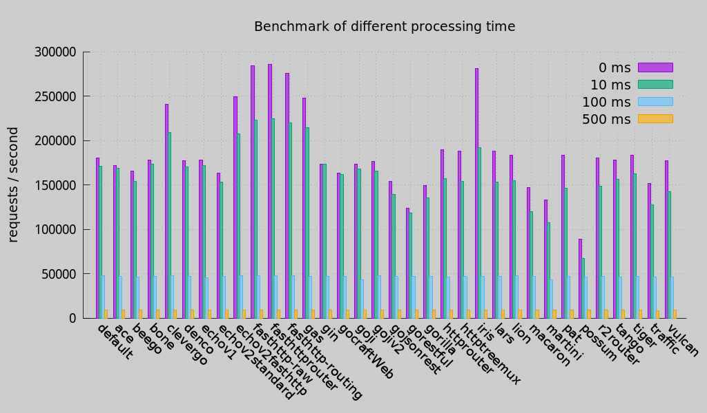

# go-web-framework-benchmark
This benchmark suite aims to compare the performance of Go web frameworks. It is inspired by [Go HTTP Router Benchmark](https://github.com/julienschmidt/go-http-routing-benchmark) but this benchmark suite is different with that. Go HTTP Router Benchmark suit aims to compare the performance of **routers** but this Benchmark suit aims to compare the whole HTTP request processing.

## Tested web frameworks

[default http](https://golang.org/pkg/net/http/)
[macaron](https://github.com/Unknwon/macaron)
[go-json-rest](https://github.com/ant0ine/go-json-rest)
[beego](https://github.com/astaxie/beego)
[pat](https://github.com/bmizerany/pat)
[lion](https://github.com/celrenheit/lion)
[httptreemux](https://github.com/dimfeld/httptreemux)
[go-restful](https://github.com/emicklei/go-restful)
[gin](https://github.com/gin-gonic/gin)
[martini](https://github.com/go-martini/martini)
[lars](https://github.com/go-playground/lars)
[bone](https://github.com/go-zoo/bone)
[gocraft](https://github.com/gocraft/web)
[gorilla](https://github.com/gorilla/mux)
[httprouter](https://github.com/julienschmidt/httprouter)
[iris](https://github.com/kataras/iris)
[tango](https://github.com/lunny/tango)
[vulcan](https://github.com/mailgun/route)
[possum](https://github.com/mikespook/possum)
[denco](https://github.com/naoina/denco)
[traffic](https://github.com/pilu/traffic)
[ace](https://github.com/plimble/ace)
[go-tigertonic](https://github.com/rcrowley/go-tigertonic)
[fasthttp](https://github.com/valyala/fasthttp)
[r2router](https://github.com/vanng822/r2router)
[goji](https://github.com/zenazn/goji/web)
[gojiv2](http://goji.io)
[echo](http://gopkg.in/labstack/echo.v1)


## Motivation
When I investigated performance of Go web frameworks, I found [Go HTTP Router Benchmark](https://github.com/julienschmidt/go-http-routing-benchmark), created by Julien Schmidt. He also developed a high performance http router: [httprouter](https://github.com/julienschmidt/httprouter). I had thought I got the performance result until I created a piece of codes to mock the real business logics:

```go
api.Get("/rest/hello", func(c *XXXXX.Context) {
		sleepTime := strconv.Atoi(os.Args[1]) //10ms
		if sleepTime > 0 {
			time.Sleep(time.Duration(sleepTime) * time.Millisecond)
		}

		c.Text("Hello world")
	})
```

When I use the above codes to test those web frameworks, the token time of route selection is not so important in the whole http request processing, although performance of route selection of web frameworks are very different.

So I create this project to compare performance of web frameworks including connection, route selection, handler processing. It mocks business logics and can set a special processing time.

The you can get some interesting results if you use it to test.

## Implementation 
When you test a web framework, this test suit will starts a simple http server implemented by this web framework. It is a real http server and only contains GET url: "/hello".

When this server processes this url, it will sleep n milliseconds in this handler. It mocks the business logics such as:
* read data from sockets
* write data to disk
* access databases
* access cache servers
* invoke other microservices
* ……

It contains a test.sh that can do those tests automatically.

It uses `wrk` to test.

## Basic Test 
The first test case is to mock 0 ms, 10 ms, 100 ms, 500 ms processing time in handlers.



the concurrency clients are 5000.

## Concurrency Test 
In 30 ms processing time, the tets result for 100, 1000, 5000 clients is:


